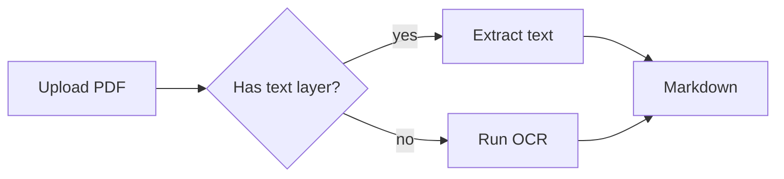
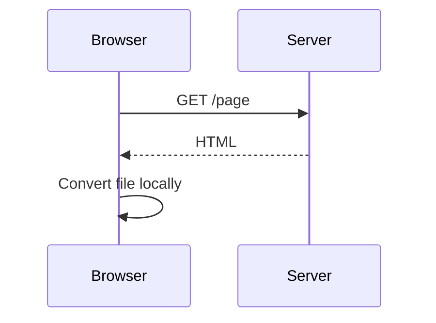
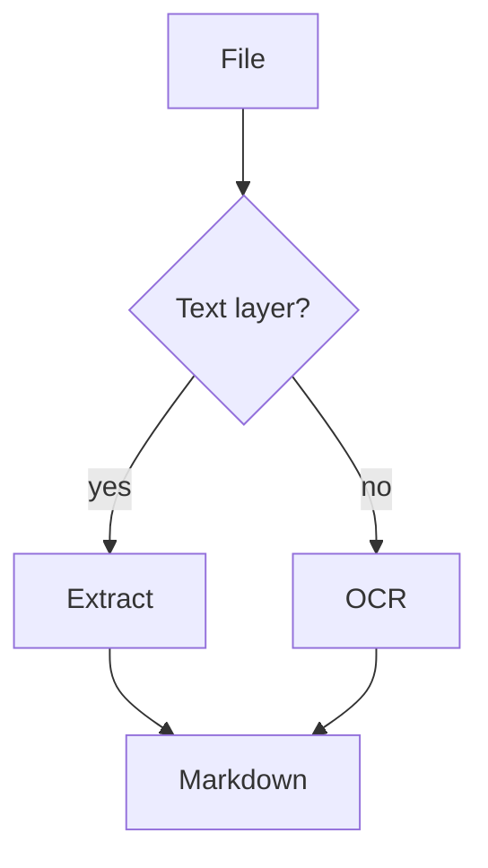

Technical documents need more than text. A design doc needs an architecture diagram; lecture notes need equations; a runbook needs a flowchart. Markdown handles both through two widely supported extensions — **Mermaid** for diagrams and **LaTeX math** for equations — and both survive the trip to PDF if the converter supports them.

## Diagrams with Mermaid

Mermaid turns a short text description into a diagram. You write it in a fenced code block tagged `mermaid`:

````markdown

````

The same block renders as a diagram on GitHub, GitLab, in Obsidian, and in many documentation generators. Text in the file stays diff-able: changing an arrow is a one-line change in review.

The diagram types used most:

| Type | Starts with | Good for |
|---|---|---|
| Flowchart | `flowchart TD` or `LR` | Processes, decisions |
| Sequence | `sequenceDiagram` | API calls, message flows |
| Class | `classDiagram` | Data models |
| State | `stateDiagram-v2` | Lifecycles, status machines |
| Gantt | `gantt` | Schedules |
| Pie | `pie` | Simple proportions |

A sequence diagram, for example:

````markdown

````

### Common Mermaid mistakes

- **The fence must say `mermaid`**, lower case, with nothing else on the line. ` ```Mermaid ` or ` ``` mermaid diagram ` may not render.
- **Special characters in labels** — parentheses, quotes, `#` — break the parser. Wrap the label in quotes: `A["Step (optional)"]`.
- **Arrows differ by diagram type.** `-->` in a flowchart, `->>` in a sequence diagram.
- **One diagram per block.** Two diagrams in the same fence is a syntax error.

When a diagram does not render, the error message usually points at the line. The [Mermaid documentation](https://mermaid.js.org/intro/) has the full syntax for each type.

## Equations with LaTeX math

Math uses LaTeX syntax between dollar signs:

- **Inline:** `$E = mc^2$` renders inside the sentence.
- **Display:** `$$ ... $$` on its own lines renders centred, on its own line.

```markdown
The area of a circle is $A = \pi r^2$.

$$
\int_0^1 x^2 \, dx = \frac{1}{3}
$$
```

A few constructs cover most documents:

| You want | Write |
|---|---|
| Fraction | `\frac{a}{b}` |
| Power, index | `x^2`, `x_i` (use braces for more than one character: `x^{10}`) |
| Square root | `\sqrt{x}` |
| Sum, integral | `\sum_{i=1}^{n}`, `\int_a^b` |
| Greek letters | `\alpha`, `\beta`, `\pi`, `\Sigma` |
| Aligned equations | `\begin{aligned} a &= b \\ c &= d \end{aligned}` inside `$$` |

### The dollar-sign problem

"It costs $5 and $10" should not become math. Most renderers — including the converter on this site — follow Pandoc's rule: an opening `$` must be followed by a non-space character, and a closing `$` must be preceded by one and not followed by a digit. So `$5 and $10` stays text, while `$x$` is math. If a price still turns into an equation, escape the sign: `\$5`.

## Exporting to PDF

### In the browser

[Markdown to PDF](/md-to-pdf) renders Mermaid diagrams and LaTeX math in the live preview and in the exported PDF, along with code highlighting, tables, task lists and images. The Markdown is converted in your browser; nothing is uploaded.

Two export modes:

- **Download PDF** builds the file directly — fast, with selectable text. Diagrams and equations are embedded as high-resolution images.
- **Save as PDF** uses your browser's print engine, which keeps diagrams and equations as vector graphics and supports every writing system, including right-to-left and complex scripts.

The tool has a **Try diagrams & math** button that loads an example document to start from.

### With Pandoc

Pandoc converts math natively through a LaTeX engine:

```bash
pandoc notes.md -o notes.pdf --pdf-engine=xelatex
```

Mermaid is not built in; it needs a filter such as `mermaid-filter` and a headless browser to draw the diagrams. It is the most configurable route and the heaviest to install.

### From VS Code

Extensions such as *Markdown PDF* or *Markdown Preview Enhanced* export from the editor. Support for Mermaid and math depends on the extension and its settings; check a document with both before relying on it.

## A template to start from

````markdown
# System design: document converter

## Flow



## Cost model

Processing time grows linearly with pages:

$$
T(n) = t_0 + n \cdot t_p
$$

where $t_0$ is start-up time and $t_p$ the time per page.
````

Paste it into [Markdown to PDF](/md-to-pdf), adjust, and export. For the rest of the syntax — tables, task lists, footnotes — see the [Markdown cheat sheet](/blog/markdown-cheat-sheet).
